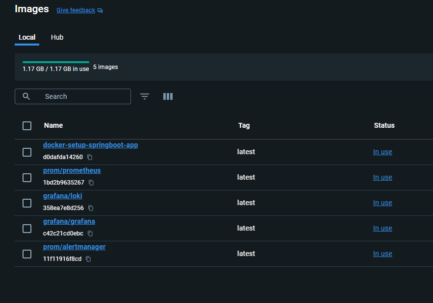

# App Monitoring
***

## Run Locally
***

1. ### First build the Springboot application
   `mvn clean package`  
    > springboot-app-monitoring.jar file will be created in the target folder.

2. ### To spin up the applications (springboot-app, prometheus, alert-manager, loki and grafana) in docker

   > Make sure Docker engine is running in your machine.  

   > Change the values of **email host**, **email id**, **email password** and **to email id** in *docker-setup/alertmanager/alertmanager.yml* file with actual values.  

    #### Change the directory to docker-setup
    `cd docker-setup`

    #### Run below command to start the applications
    `docker compose up`

   >Once the application is started successfully, you can see all the Images of the applications and the Container details in the docker as shown below

   

   

3. ### The applications UI can be accessed from below link
   [Prometheus](http://localhost:9090/)  
   [Alert Manager](http://localhost:9093/)  
   [Grafana](http://localhost:3000/)  
  
   > For Grafana the default login username and password is **admin**

4. ### To stop the applications 
    `docker compose down`

5. ### To stop and remove the Container and Images of the applications
    `docker compose down --rmi all`